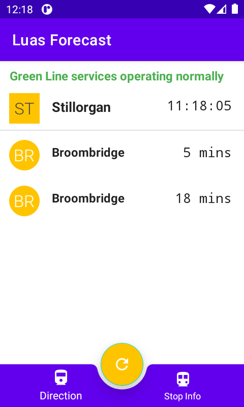

# LuasApp

### Description
Luas tram forecast. The application consists of 2 fragments. The first satisfies the below use cases. The second present the user the particular station info.
The user can user the refresh button or swipe down to fetch new data.

### Use cases

1. Given I am a LUAS passenger
When I open the app from 00:00 – 12:00
Then I should see trams forecast from Marlborough LUAS stop towards Outbound.
[Marlborough](http://luasforecasts.rpa.ie/xml/get.ashx?action=forecast&amp;stop=mar&amp;encrypt=false)

2. Given I am a LUAS passenger
When I open the app from 12:01 – 23:59
Then I should see trams forecast from Stillorgan LUAS stop towards Inbound.
[Stillorgan](http://luasforecasts.rpa.ie/xml/get.ashx?action=forecast&amp;stop=sti&amp;encrypt=false)

### Libraries
* Kodein DI on Android. [Kodein](https://kodein.org/Kodein-DI/?5.0/android) 
* Retrofit, A type-safe HTTP client for Android. [Retrofit](https://square.github.io/retrofit/)
* Xml parcer. [tikxml](https://github.com/Tickaroo/tikxml)
* Kotlin coroutines. [Coroutines](https://developer.android.com/kotlin/coroutines)

### Testing
Base tests are performed.

* Calculation of the location and the stop based on time.
* Http client parcing tests.
* Http client connectivity tests.
* UI visibility tests.

